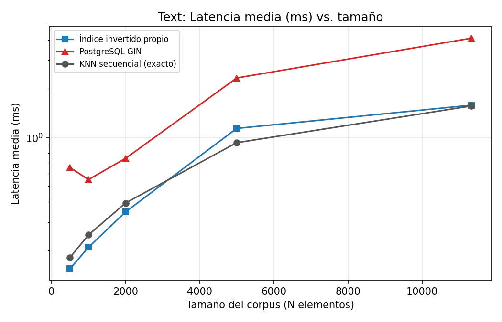
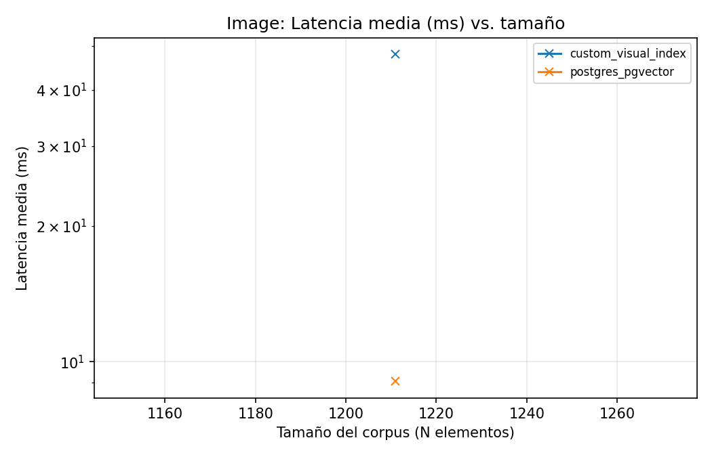
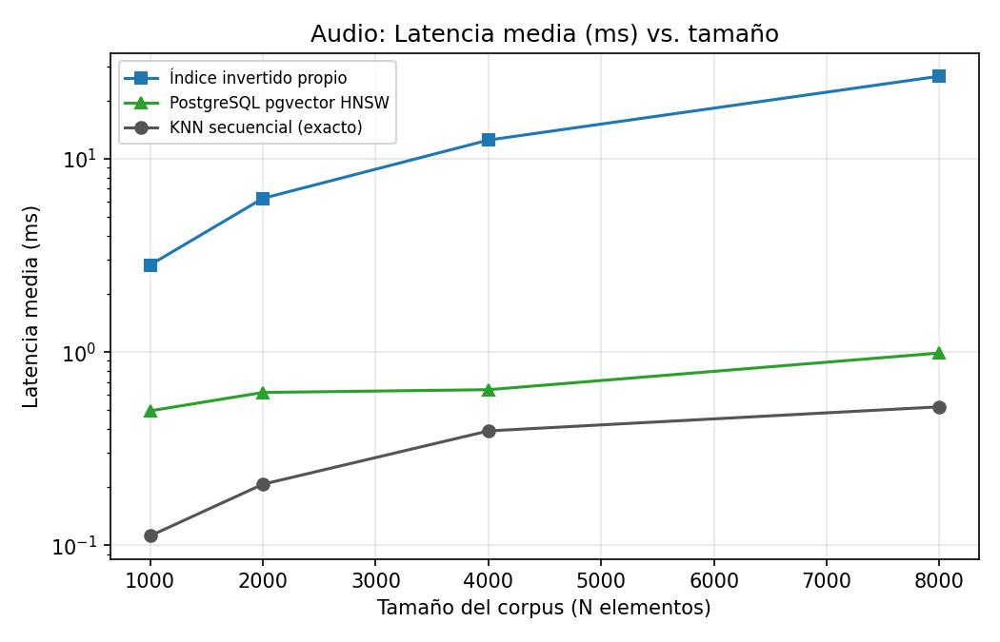
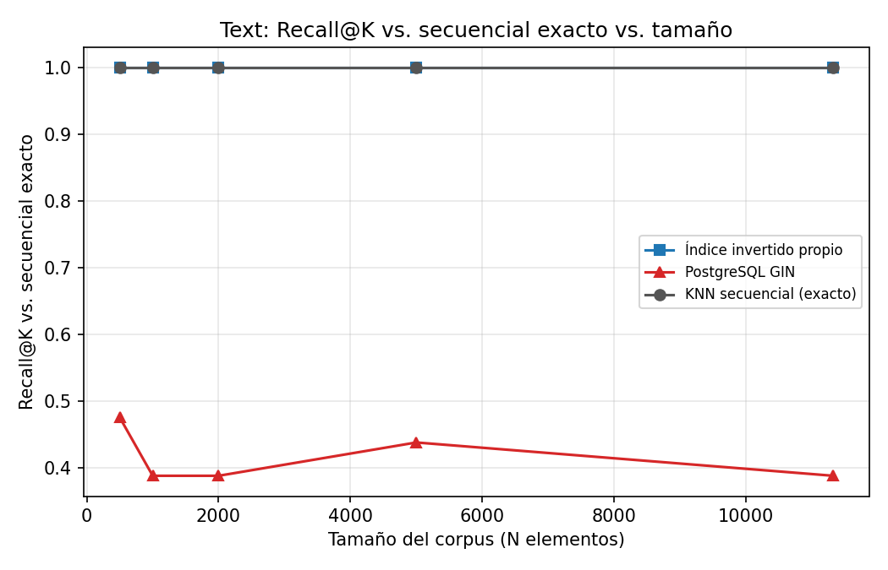
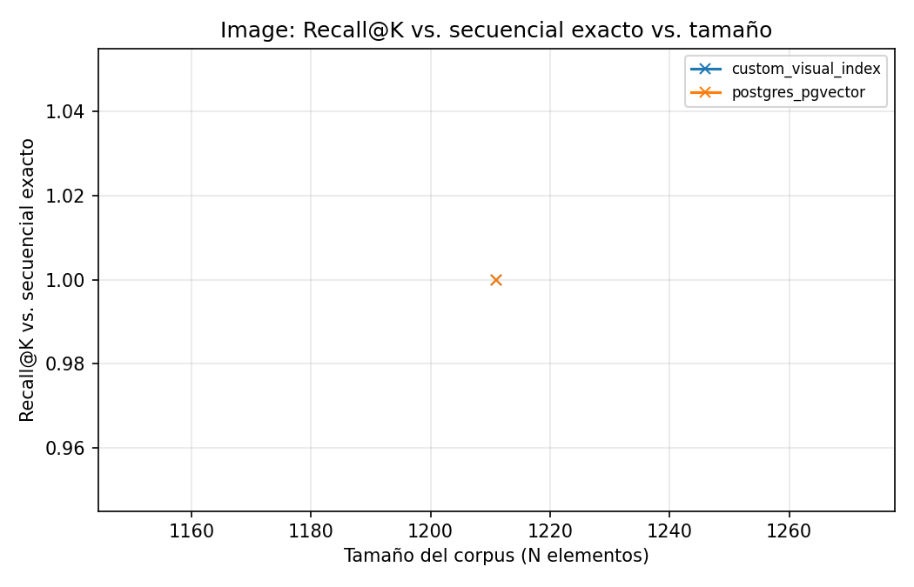
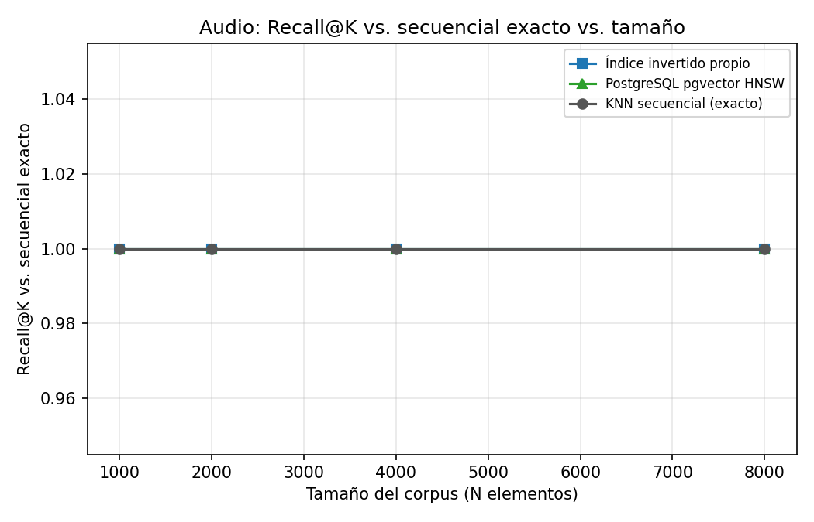
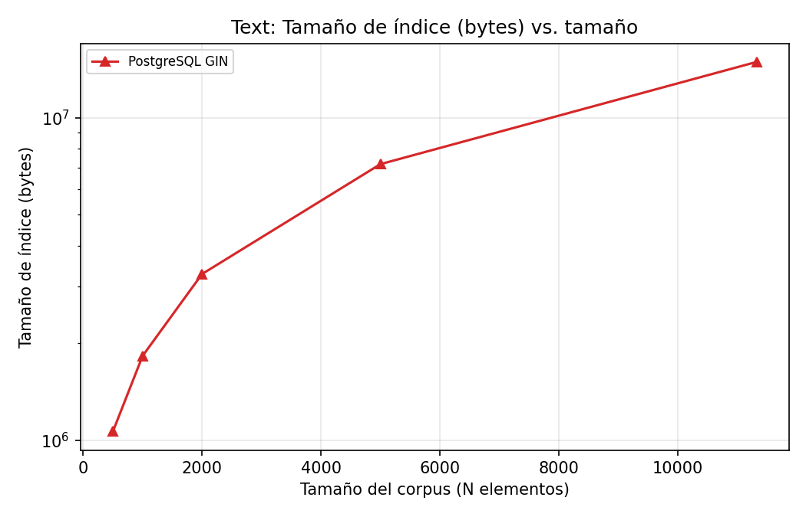
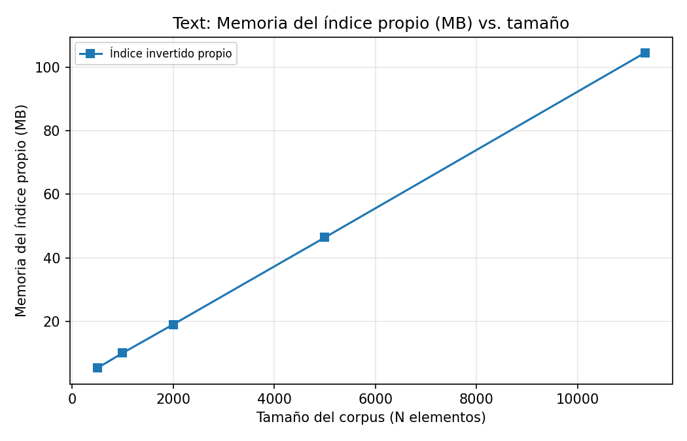

# Sistema Multimodal de Recuperación y Búsqueda — BD2

Motor de recuperación por contenido que aplica **una misma arquitectura** a texto,
imágenes y audio:

```text
split → extracción de features → codebook → histogramas/pesos → índice invertido → ranking por coseno
```

Cada modalidad se compara contra el índice **nativo de PostgreSQL** equivalente
(GIN full-text para texto; `pgvector` HNSW para imagen y audio) y contra un
**KNN secuencial exacto** que sirve de *ground truth* para medir precisión.

Se implementan **dos aplicaciones** sobre el mismo backend:

1. **Búsqueda multimodal en documentos** (PMC Open Access): texto + figuras.
2. **Búsqueda musical inteligente** (FMA Small): similitud acústica + metadata.

---

## Tabla de contenidos

1. [Dominio de datos y justificación](#1-dominio-de-datos-y-justificación)
2. [Arquitectura del sistema](#2-arquitectura-del-sistema)
3. [Implementación por módulo](#3-implementación-por-módulo)
4. [Índice invertido: memoria secundaria y coseno](#4-índice-invertido-memoria-secundaria-y-similitud-de-coseno)
5. [Comparativas en PostgreSQL (GIN y pgvector)](#5-comparativas-en-postgresql)
6. [KNN secuencial e indexado + maldición de la dimensionalidad](#6-knn-secuencial-e-indexado-y-maldición-de-la-dimensionalidad)
7. [Resultados experimentales](#7-resultados-experimentales)
8. [Análisis crítico y conclusiones](#8-análisis-crítico-y-conclusiones)
9. [ParserSQL y GUI](#9-parsersql-y-gui)
10. [Instalación y uso](#10-instalación-y-uso)
11. [Mini-manual de usuario](#11-mini-manual-de-usuario)
12. [API](#12-api)

---

## 1. Dominio de datos y justificación

### Datasets y distribución (procesados en este repositorio)

| Modalidad | Dataset | Unidad indexada | Cantidad | Codebook | Postings del índice invertido |
|---|---|---|---:|---:|---:|
| **Texto** | PMC Open Access (219 artículos) | chunk / párrafo | **11,327** | 5,000 términos | 1,041,621 |
| **Imagen** | Figuras de PMC | imagen (histograma BoVW) | **1,211** | 256 visual words | 225,598 |
| **Audio** | FMA Small | track (histograma BoAW) | **7,997** | 256 acoustic words | 494,563 |

- **Texto:** artículos científicos reales; cada chunk es un párrafo limpio. El
  vocabulario TF-IDF selecciona los 5,000 términos más informativos.
- **Imagen:** figuras extraídas de los artículos; descriptores locales SIFT.
- **Audio:** FMA Small está **perfectamente balanceado**: 1,000 tracks por cada
  uno de 8 géneros (Hip-Hop, Pop, Folk, Experimental, Rock, International,
  Electronic, Instrumental). Se procesaron los 8,000 clips de 30 s (3 fallaron al
  decodificar → 7,997). Ese balance evita sesgos de clase en la evaluación.

### ¿Por qué una base de datos multimodal para recuperación por contenido?

El texto puede indexarse con palabras, pero **imágenes y audio no tienen "palabras"
naturales**: son señales de alta dimensión (SIFT ∈ ℝ¹²⁸ por keypoint, MFCC ∈ ℝ²⁰
por ventana). Buscar por *contenido* (no por etiquetas manuales) exige:

1. Convertir la señal en descriptores locales.
2. **Cuantizarlos** contra un diccionario aprendido (codebook) para obtener
   "palabras visuales/acústicas".
3. Representar cada objeto como un **histograma de codewords** — el análogo
   multimodal de un *bag of words*.

Con esa representación unificada, **la misma maquinaria de índice invertido +
ranking por coseno** sirve para las tres modalidades, y una única base de datos
almacena documentos, figuras y canciones consultables por similitud de contenido.
Ese es el valor de un motor multimodal: un solo paradigma, un solo backend, tres
tipos de consulta.

---

## 2. Arquitectura del sistema

```text
Dataset → Ingesta → Split por modalidad → Extracción de features → Codebook
   → Histogramas / pesos → Índice invertido propio  ┐
                                                     ├→ PostgreSQL (persistencia + comparativas)
                                                     ┘
   → API FastAPI → Streamlit UI (+ Consola SQL)
```

| Capa | Módulo |
|---|---|
| Ingesta | [`src/ingestion/`](src/ingestion/) |
| Extracción / codebook / histogramas | [`src/extractors/`](src/extractors/) |
| Índices invertidos (SPIMI / BoVW / BoAW) | [`src/indexing/`](src/indexing/) |
| Búsqueda propia, secuencial y PostgreSQL | [`src/search/`](src/search/) |
| Persistencia y carga | [`src/database/`](src/database/) |
| Evaluación (benchmark de escalamiento + gráficos) | [`src/evaluation/`](src/evaluation/) |
| API | [`src/api/main.py`](src/api/main.py) |
| Interfaz | [`app/streamlit_app.py`](app/streamlit_app.py) |

---

## 3. Implementación por módulo

### Split (unidades atómicas)
- **Texto:** párrafos/chunks del artículo.
- **Imagen:** keypoints/descriptores locales SIFT por figura.
- **Audio:** ventanas deslizantes (`n_fft=2048`, `hop=512`) sobre 30 s a 22.05 kHz.

### Extractor
- **Texto:** `TfidfVectorizer` (minúsculas, *stopwords* en inglés, `min_df=2`,
  `max_features=5000`). Los vectores TF-IDF salen **normalizados L2**, de modo que
  el producto punto equivale directamente a la similitud de coseno.
- **Imagen:** `cv2.SIFT` sobre la figura redimensionada a 512×512.
- **Audio:** 20 coeficientes MFCC por ventana (`librosa`).

### Codebook
- **Texto (lingüístico):** tokenización → normalización → *stopwords* → selección
  de los *top-k* términos más informativos (el vocabulario TF-IDF es el codebook).
- **Imagen (BoVW):** `MiniBatchKMeans` sobre **todos** los SIFT → 256 centroides =
  *visual words*.
- **Audio (BoAW):** `MiniBatchKMeans` sobre **todos** los MFCC → 256 centroides =
  *acoustic words*.

### Histogramas
Cada figura/track se cuantiza asignando cada descriptor a su centroide más cercano
y contando frecuencias → histograma de 256 dimensiones, **normalizado L2**.

### Índice invertido
Para cada codeword se guarda la lista de objetos que la contienen con su peso:
`term_id → [(chunk_id, w), …]`. Ver la siguiente sección.

---

## 4. Índice invertido: memoria secundaria y Similitud de Coseno

### Construcción en memoria secundaria (SPIMI)

El índice de texto se construye con **SPIMI** ([`build_text_spimi_index.py`](src/indexing/build_text_spimi_index.py)):
se recorre la colección **por bloques** de documentos, cada bloque genera sus
*postings* parciales y luego se fusionan. El índice resultante se **persiste en
disco** en dos formas:

- `*.pkl` — para la búsqueda en memoria del backend propio.
- `*.csv` → tabla `text_inverted_index` en **PostgreSQL** (memoria secundaria),
  con 1,041,621 postings de texto, 225,598 visuales y 494,563 acústicos.

De este modo el índice no depende de mantener toda la colección en RAM: los
bloques y los postings viven en disco y se cargan bajo demanda.

### Ejecución eficiente con Similitud de Coseno

Como los vectores TF-IDF y los histogramas están **normalizados L2**, la similitud
de coseno se reduce a un **producto punto**. El índice invertido lo calcula sin
recorrer toda la colección: solo acumula sobre las *codewords no nulas* de la
consulta.

```text
score(doc) = Σ_{t ∈ query}  peso_query[t] · peso_doc[t]     (postings de t)
```

Esto es matemáticamente **idéntico** al coseno exacto — de ahí que el índice
invertido logre **recall@10 = 1.0** frente al KNN secuencial (sección 7), pero
visitando solo una fracción de la colección cuando los vectores son dispersos.

---

## 5. Comparativas en PostgreSQL

### Texto — GIN (Generalized Inverted Index)

`text_chunks.search_vector` es una columna `tsvector` **generada** (`to_tsvector('english', …)`).
Un índice **GIN** sobre ella mapea cada *lexema* → lista de filas que lo contienen
(es, conceptualmente, un índice invertido nativo). La consulta usa
`search_vector @@ plainto_tsquery(...)` para filtrar y `ts_rank(...)` para ordenar.
GIN es un índice de **coincidencia booleana + ranking propio**, no de coseno: por
eso recupera un conjunto distinto al del top-k por TF-IDF (ver análisis).

### Imagen / Audio — pgvector HNSW

Los histogramas se almacenan como `vector(256)` y se indexan con **HNSW**
(`vector_cosine_ops`). HNSW es un grafo navegable jerárquico que hace búsqueda de
vecinos **aproximada** en tiempo sublineal. La consulta ordena por distancia coseno
`histogram <=> query`.

Índices definidos en [`database/03_indexes.sql`](database/03_indexes.sql).

---

## 6. KNN secuencial e indexado y maldición de la dimensionalidad

Sobre los histogramas BoVW/BoAW se implementan **dos variantes de KNN**:

- **Secuencial (exacto):** [`src/search/sequential_knn.py`](src/search/sequential_knn.py)
  — escaneo lineal que calcula el coseno contra **todos** los objetos. Es el
  *ground truth* de precisión.
- **Indexado:** índice invertido propio (producto punto disperso) y pgvector HNSW.

### Maldición de la dimensionalidad y su mitigación

- Los descriptores crudos son de **alta dimensión** (SIFT 128, MFCC 20 por ventana
  × miles de ventanas). Compararlos directamente es costoso y las distancias
  pierden contraste al crecer la dimensión.
- **Mitigación por cuantización:** el codebook reduce cada objeto a un histograma
  de 256 dimensiones fijas → representación compacta y comparable.
- **Efecto observado (densidad):** los histogramas BoVW/BoAW resultan **densos**
  (casi todas las 256 codewords aparecen). Un índice invertido rinde cuando los
  vectores son **dispersos** (texto): al ser densos, degenera en visitar casi
  todos los postings, y el escaneo vectorizado o HNSW lo superan (sección 7).
  Esta es la lección central del experimento: *la técnica de indexación debe
  ajustarse a la densidad de la representación*.

---

## 7. Resultados experimentales

Marco: [`src/evaluation/benchmark_scaling.py`](src/evaluation/benchmark_scaling.py)
barre **varios tamaños de corpus N** por modalidad y mide cada método sobre el
**mismo subconjunto** de N elementos. La latencia se mide en un solo hilo (BLAS
con 1 thread) y, para PostgreSQL, con el *Execution Time* de `EXPLAIN (ANALYZE,
BUFFERS)` (aísla el índice y no penaliza con la latencia de red/conexión).

> Nota de escala: PMC OA (11K chunks) y FMA Small (8K tracks) **no alcanzan 100K**;
> se reporta la curva real 0.2K–11K. La aproximación de HNSW no se degrada a estos
> tamaños (recall = 1.0), lo cual es en sí un hallazgo.

### Resumen al mayor tamaño de cada modalidad

| Modalidad | N | Método | Latencia (ms) | Throughput (q/s) | Recall@10 | Índice (MB) |
|---|---:|---|---:|---:|---:|---:|
| **Texto** | 11,327 | secuencial (exacto) | 1.57 | 745 | 1.00 | — |
| | | **índice invertido** | **1.58** | 720 | **1.00** | en RAM |
| | | PostgreSQL GIN | 4.11 | 330 | **0.39** | 14.2 |
| **Imagen** | 1,211 | secuencial (exacto) | 0.24 | 5,015 | 1.00 | — |
| | | índice invertido | 27.9 | 38 | 1.00 | en RAM |
| | | **pgvector HNSW** | **1.21** | 1,046 | 1.00 | 1.7 |
| **Audio** | 7,997 | secuencial (exacto) | 0.52 | 1,956 | 1.00 | — |
| | | índice invertido | 26.8 | 48 | 1.00 | en RAM |
| | | **pgvector HNSW** | **0.99** | 1,063 | 1.00 | 10.6 |

Tablas completas en [`results/tables/`](results/tables/); resumen agregado en
`results/tables/benchmark_summary.csv`.

### Curvas de escalamiento (latencia vs. N)

| Texto | Imagen | Audio |
|---|---|---|
|  |  |  |

### Precisión — Recall@10 vs. el KNN secuencial exacto

| Texto (GIN diverge del coseno) | Imagen | Audio |
|---|---|---|
|  |  |  |

### Tamaño de índice y memoria

| Índice PostgreSQL vs. N (texto) | Memoria del índice propio (texto) |
|---|---|
|  |  |

---

## 8. Análisis crítico y conclusiones

**¿Qué técnica ganó en qué métrica?**

- **Texto:** el **índice invertido propio empata al secuencial exacto** (≈1.6 ms,
  recall 1.0) y **supera a GIN** en latencia (4.1 ms). Aquí la dispersión del
  TF-IDF juega a favor del invertido.
- **Imagen y audio:** con histogramas **densos**, **pgvector HNSW gana** (≈1 ms,
  recall 1.0). El índice invertido es el **más lento** (27 ms) porque no hay
  dispersión que explotar; el escaneo secuencial vectorizado incluso lo supera a
  estas escalas.

**¿Se recuperó la misma información (precisión)?**

- Índice invertido y secuencial devuelven **exactamente el mismo top-k** (recall
  1.0): el invertido es coseno exacto, solo que más rápido cuando hay dispersión.
- **GIN recupera información distinta** al top-k por coseno TF-IDF (recall ≈ 0.39):
  su semántica es *coincidencia booleana + ts_rank*, no similitud vectorial. Es un
  resultado esperado y una advertencia práctica: GIN y búsqueda por coseno **no son
  intercambiables**.
- HNSW coincide al 100 % con el exacto a estas escalas (no se observa error de
  aproximación hasta 8K).

**Trade-offs (exactitud/velocidad, memoria/latencia, simplicidad/sofisticación):**

- **Índice invertido:** simple, exacto, sin costo de almacenamiento extra en RAM,
  **excelente en alta dimensión dispersa (texto)**; pobre en vectores densos.
- **pgvector HNSW:** rapidísimo y persistente, ideal para histogramas densos;
  cuesta espacio de índice (1.7–10.6 MB) y es aproximado (riesgo de recall < 1 a
  gran escala).
- **Secuencial:** sin índice, exacto, sorprendentemente competitivo a estas
  escalas por vectorización BLAS; no escala a millones.

**Limitaciones y recomendaciones:**

- El corpus no llega a 100K; para ver el punto donde HNSW pierde recall y el
  secuencial se vuelve inviable habría que ampliar los datasets.
- **Recomendación de diseño:** usar índice invertido para la modalidad textual
  (dispersa) y pgvector/HNSW para las modalidades densas (imagen/audio). Es decir,
  *la arquitectura es unificada, pero el índice óptimo depende de la densidad*.

---

## 9. ParserSQL y GUI

### ParserSQL ([`src/search/query_parser.py`](src/search/query_parser.py))

SQL para recuperar texto y multimedia:

```sql
SELECT * FROM articles WHERE text  @@ 'machine learning' LIMIT 10 USING custom;
SELECT * FROM articles WHERE text  @@ 'deep learning'    LIMIT 10 USING postgres;
SELECT * FROM images   WHERE image <-> 'ruta/figura.jpg' LIMIT 8  USING pgvector;
SELECT * FROM songs    WHERE genre @@ 'Hip-Hop'          LIMIT 10;
SELECT * FROM songs    WHERE audio <-> 'ruta/track.mp3'  LIMIT 5  USING custom;
```

- Operadores: `@@` (full-text) y `<->` (vecino más cercano / KNN).
- Tablas: `articles` (texto), `images` (imagen), `songs` (audio o metadata).
- Cláusulas: `LIMIT n`, `USING custom|postgres`.
- Expuesto en `GET /query/sql?sql=...` y en la pestaña **Consola SQL** del frontend.

### GUI (Streamlit)

Interfaz con módulos: **Estado** del corpus, **Consola SQL**, **Documentos**
(texto e imagen) y **Música** (metadata y audio). Diseño limpio, resultados con
score y latencia, reproducción de audio y previsualización de figuras. Los
benchmarks y sus gráficos se ejecutan desde la línea de comandos (sección 10) y
los resultados se documentan en la sección 7.

---

## 10. Instalación y uso

### 1. Entorno

```bash
python3 -m venv .venv && source .venv/bin/activate
pip install -r requirements.txt
cp .env.example .env     
```

### 2. PostgreSQL (Docker con pgvector)

```bash
docker compose up -d db
```

### 3. Pipelines de datos

```bash
bash scripts/run_pmc_pipeline.sh          # texto + imagen
FMA_MAX_TRACKS=8000 bash scripts/run_fma_pipeline.sh   # audio (los 8,000 clips)
python src/database/load_all.py           # cargar/sincronizar PostgreSQL
```

### 4. Benchmarks y gráficos (escalamiento)

```bash
python src/evaluation/benchmark_scaling.py           # texto + imagen + audio
python src/evaluation/plot_results.py                # curvas + resumen
```

### 5. API y frontend

```bash
PYTHONPATH=$PWD uvicorn src.api.main:app --reload
API_URL=http://localhost:8000 streamlit run app/streamlit_app.py
```

O todo con Docker: `docker compose up` (db + api + app).

---

## 11. Mini-manual de usuario

1. **Levanta el sistema** (`docker compose up` o los pasos 2–5 de arriba) y abre
   la interfaz en `http://localhost:8501`.
2. **Estado:** verifica que el corpus esté cargado (documentos, chunks, imágenes,
   canciones, histogramas).
3. **Consola SQL:** escribe una consulta o usa los botones de ejemplo. Elige el
   índice con `USING custom` (índice propio) o `USING postgres` (GIN/pgvector).
   Pulsa **Ejecutar** para ver modalidad, método, latencia y resultados.
4. **Documentos → Texto:** escribe una consulta, elige *custom*, *gin* o
   *comparar* (muestra ambos lado a lado con Overlap@K).
5. **Documentos → Imagen:** elige una figura de ejemplo o sube una imagen; el
   sistema devuelve las figuras más parecidas.
6. **Música → Audio:** elige un track de ejemplo o sube un `mp3`; obtienes las
   canciones acústicamente más similares (con reproductor).

> Los benchmarks y gráficos comparativos se generan por CLI (sección 10) y se
> presentan en la sección 7; no forman parte de la interfaz interactiva.

---

## 12. API

```text
GET  /health
GET  /datasets/stats
GET  /query/sql?sql=...                     # ParserSQL multimodal
GET  /documents/search/text?q=...&method=custom|gin
GET  /documents/search/text/compare?q=...
POST /documents/search/image?method=custom|pgvector      (multipart file)
GET  /documents/{article_id}
GET  /music/search/metadata?q=...
POST /music/search/audio?method=custom|pgvector          (multipart file)
GET  /benchmarks/results
POST /benchmarks/run/{text|image|audio|plots}
```

### Nota sobre dimensiones

`K_VISUAL = K_AUDIO = 256` → columnas `vector(256)`. Si cambias K, actualiza
[`database/02_schema.sql`](database/02_schema.sql).
